# Open-AutoGLM Server 架构类图

## PlantUML 类图

```plantuml
@startuml Open-AutoGLM Server Class Diagram

skinparam classAttributeIconSize 0
skinparam packageStyle rectangle

' ==================== Enums ====================

package "Enums" {
    enum MessageType {
        DEVICE_REGISTER
        DEVICE_STATUS
        OBSERVE_RESULT
        TASK_COMPLETE
        TASK_ERROR
        TASK_ASSIGN
        ACTION_CMD
        INTERRUPT
        DEVICE_UPDATE
        TASK_UPDATE
        AGENT_EVENT
        WEB_CREATE_TASK
        WEB_INTERRUPT_TASK
        AUTH
        REGISTER
        HEARTBEAT
        ACK
        WELCOME
        ERROR
        SUBSCRIBE
    }

    enum TaskState {
        PENDING
        ASSIGNED
        RUNNING
        WAITING_CONFIRMATION
        COMPLETED
        FAILED
        INTERRUPTED
        CANCELLED
    }

    enum TaskPriority {
        LOW
        NORMAL
        HIGH
        URGENT
    }

    enum ActionStatus {
        PENDING
        ACKNOWLEDGED
        COMPLETED
        TIMEOUT
        CANCELLED
    }

    enum TaskPhase {
        IDLE
        REASON
        ACT
        OBSERVE
    }

    enum DevicePlatform {
        ANDROID
        HARMONYOS
        IOS
    }
}

' ==================== WebSocket Hub ====================

package "WebSocket Service" {
    class ConnectionState {
        connection_id: str
        client_id: Optional[str]
        device_id: Optional[str]
        session_id: Optional[str]
        connected_at: datetime
        last_heartbeat: datetime
        subscriptions: Set[str]
        is_authenticated: bool
        capabilities: dict
    }

    class OfflineMessageCache {
        _cache: Dict[str, List[dict]]
        _lock: asyncio.Lock
        _max_cache_size: int
        --
        store_message()
        get_and_clear()
        has_pending()
    }

    class WebSocketHub {
        connections: Dict[str, WebSocket]
        connection_states: Dict[str, ConnectionState]
        subscriptions: Dict[str, Set[str]]
        device_subscriptions: Dict[str, Set[str]]
        task_subscriptions: Dict[str, Set[str]]
        _device_connections: Dict[str, str]
        _heartbeat_task: Optional[asyncio.Task]
        _offline_cache: OfflineMessageCache
        --
        start()
        stop()
        connect()
        disconnect()
        send_message()
        send_to_device()
        register_device()
        unregister_device()
        is_device_connected()
        broadcast()
        broadcast_device_update()
        broadcast_task_update()
        broadcast_agent_step()
        broadcast_agent_status()
        broadcast_task_result()
        subscribe()
        unsubscribe()
        update_heartbeat()
        _heartbeat_check()
        _check_stale_devices()
    }

    OfflineMessageCache "1" *-- "*" WebSocketHub : uses
}

' ==================== Task Registry ====================

package "Task Service" {
    class TaskInfo {
        task_id: str
        device_id: str
        instruction: str
        state: TaskState
        priority: TaskPriority
        mode: str
        max_steps: int
        current_step: int
        created_at: float
        assigned_at: Optional[float]
        started_at: Optional[float]
        completed_at: Optional[float]
        last_update: float
        result_message: str
        result_data: dict
        error_message: str
        source: str
        created_by: str
        on_state_change: Optional[Callable]
        on_step_update: Optional[Callable]
        --
        duration_seconds: float
        is_active: bool
        to_dict(): dict
    }

    class TaskRegistry {
        _ws_hub: WebSocketHub
        _tasks: Dict[str, TaskInfo]
        _device_tasks: Dict[str, List[str]]
        _lock: asyncio.Lock
        --
        create_task()
        get_task()
        get_device_tasks()
        get_active_tasks()
        update_task_state()
        update_task_step()
        cancel_task()
        interrupt_task()
        _is_valid_transition()
        _broadcast_update()
        _broadcast_step_update()
        _persist_task()
        get_all_tasks()
        get_stats()
    }

    TaskState <-- TaskInfo : uses
    TaskPriority <-- TaskInfo : uses
    TaskInfo "1" *-- "*" TaskRegistry : manages
}

' ==================== Action Router ====================

package "Action Router" {
    class PendingAction {
        action_id: str
        task_id: str
        device_id: str
        action: dict
        reasoning: str
        step_number: int
        status: ActionStatus
        created_at: float
        last_update: float
        timeout_seconds: float
        result: Optional[dict]
        error: Optional[str]
        --
        is_expired: bool
    }

    class ActionRouter {
        _ws_hub: WebSocketHub
        _pending_actions: Dict[str, PendingAction]
        _action_futures: Dict[str, asyncio.Future]
        _cleanup_task: Optional[asyncio.Task]
        _running: bool
        --
        start()
        stop()
        send_action()
        wait_for_result()
        handle_observe_result()
        cancel_action()
        execute_action()
        _find_pending_action()
        _cleanup_action()
        _cleanup_loop()
    }

    ActionStatus --> PendingAction : uses
}

' ==================== Agent Service ====================

package "Agent Service" {
    class AgentStep {
        step_number: int
        phase: str
        thinking: str
        action_type: str
        action_params: dict
        action_result: str
        timestamp: datetime
        success: bool
        error: str
    }

    class AgentSession {
        session_id: str
        device_id: str
        device_uuid: str
        platform: DevicePlatform
        status: str
        task_id: str
        instruction: str
        mode: str
        max_steps: int
        current_step: int
        steps: list[AgentStep]
        _context: list[dict]
        confirmation_callback: Optional[Callable]
        action_executor: Optional[Callable]
        _model_client: Optional[OpenAI]
        --
        start_task()
        stop()
        interrupt()
        resume()
        execute_step()
        confirm_action()
        continue_task()
        _execute_and_continue()
        _execute_action()
        _call_model()
        _build_user_message()
        get_state(): dict
    }

    class AgentManager {
        _sessions: dict[str, AgentSession]
        _lock: asyncio.Lock
        --
        create_session()
        get_session()
        remove_session()
        get_all_sessions(): dict
    }

    DevicePlatform --> AgentSession : uses
    AgentStep "1" *-- "*" AgentSession : contains
}

' ==================== ReAct Scheduler ====================

package "ReAct Scheduler" {
    class DeviceTaskContext {
        system_prompt: str
        messages: list[dict]
        --
        add_message()
        truncate()
        to_api_format()
    }

    class ReActRecord {
        step_number: int
        reasoning: str
        action: dict
        action_result: str
        observation: str
        screenshot: str
        success: bool
    }

    class DeviceTask {
        device_id: str
        task_id: str
        instruction: str
        mode: str
        context: DeviceTaskContext
        react_records: list[ReActRecord]
        phase: TaskPhase
        status: TaskStatus
        current_step: int
        max_steps: int
        observe_timeout: float
        status_callback: Optional[Callable]
        step_callback: Optional[Callable]
        action_executor: Optional[Callable]
        _action_router: Optional[Any]
        _model_client: Optional[Any]
        created_at: float
        last_active_at: float
        --
        model_client: OpenAI
        action_router: Any
        is_active: bool
        is_finished: bool
        get_system_prompt()
        initialize()
        execute_reason()
        execute_act()
        set_observe()
        complete_reason()
        complete_act()
        _is_finish_action()
    }

    class ReActScheduler {
        core_threads: int
        max_threads: int
        reason_timeout: int
        observe_timeout: int
        executor: ThreadPoolExecutor
        _task_queue: list[str]
        _queue_lock: Lock
        _device_tasks: dict[str, DeviceTask]
        _running_tasks: dict[int, str]
        _running_lock: Lock
        _ws_hub: Any
        _running: bool
        --
        set_ws_hub()
        submit_task()
        get_next_task()
        requeue_task()
        remove_task()
        get_task()
        get_all_tasks()
        run_one_cycle()
        set_observe_result()
        interrupt_task()
        _broadcast_step()
        _broadcast_complete()
        start()
        stop()
        _worker_loop()
    }

    TaskPhase --> DeviceTask : uses
    TaskStatus --> DeviceTask : uses
    ReActRecord "1" *-- "*" DeviceTask : contains
    DeviceTaskContext "1" *-- "1" DeviceTask : uses
}

' ==================== Message Types ====================

package "Network Messages" {
    class WSMessage {
        msg_id: str
        type: MessageType
        timestamp: str
        version: str
        payload: dict
        --
        to_dict(): dict
    }

    class WSMessageFactory {
        -- Factory Methods --
        create_device_register()
        create_device_status()
        create_observe_result()
        create_task_complete()
        create_task_assign()
        create_action_cmd()
        create_interrupt()
        create_device_update()
        create_task_update()
        create_agent_event()
    }

    MessageType --> WSMessage : uses
    WSMessageFactory ..> WSMessage : creates
}

' ==================== Relationships ====================

WebSocketHub --> TaskRegistry : broadcasts via
WebSocketHub --> ActionRouter : sends via
ActionRouter --> TaskRegistry : notifies
TaskRegistry --> WebSocketHub : broadcasts
AgentManager --> AgentSession : manages
ReActScheduler --> DeviceTask : schedules
ReActScheduler --> ActionRouter : uses
DeviceTask --> AgentSession : similar to

@enduml
```



## 组件说明

### 1. WebSocket Service (WebSocketHub)

**文件**: `src/services/websocket.py`

| 组件 | 说明 |
|------|------|
| `ConnectionState` | WebSocket连接状态，包含连接ID、设备ID、会话ID、心跳时间等 |
| `OfflineMessageCache` | 设备离线时的消息缓存，重连后补发 |
| `WebSocketHub` | WebSocket连接管理器，负责消息广播、设备订阅、心跳检测 |

**核心功能**:
- `connect()` / `disconnect()` - 连接管理
- `send_to_device()` - 发送消息到指定设备
- `broadcast_*()` - 广播设备/任务/Agent状态更新
- `register_device()` / `unregister_device()` - 设备注册

### 2. Task Service (TaskRegistry)

**文件**: `src/services/task_registry.py`

| 组件 | 说明 |
|------|------|
| `TaskInfo` | 任务信息，包含状态、优先级、步骤追踪、回调函数 |
| `TaskRegistry` | 任务注册表，管理所有任务的生命周期 |

**状态机** (`TaskState`):
```
PENDING → ASSIGNED → RUNNING → COMPLETED/FAILED/INTERRUPTED
                ↓
         WAITING_CONFIRMATION (谨慎模式)
```

### 3. Action Router

**文件**: `src/services/action_router.py`

| 组件 | 说明 |
|------|------|
| `PendingAction` | 待执行动作追踪，包含超时控制 |
| `ActionRouter` | 动作路由器，发送action_cmd到客户端并等待结果 |

**流程**:
1. `send_action()` - 发送动作到客户端
2. `wait_for_result()` - 等待客户端返回观察结果
3. `handle_observe_result()` - 处理观察结果
4. 超时自动清理

### 4. Agent Service

**文件**: `src/services/agent.py`

| 组件 | 说明 |
|------|------|
| `AgentStep` | 单个Agent执行步骤记录 |
| `AgentSession` | 单设备Agent会话，管理ReAct循环 |
| `AgentManager` | 管理所有Agent会话（单例模式） |

**Agent状态转换**:
```
idle → running → completed/failed/interrupted
                   ↓
          waiting_confirmation (谨慎模式)
```

### 5. ReAct Scheduler

**文件**: `src/services/react_scheduler.py`

| 组件 | 说明 |
|------|------|
| `DeviceTaskContext` | 设备任务上下文，支持截断/恢复 |
| `ReActRecord` | 单次ReAct执行记录 |
| `DeviceTask` | 单个设备任务 |
| `ReActScheduler` | ReAct线程池调度器 |

**核心逻辑**:
- 线程池执行各设备的一轮ReAct
- 每轮完成后放回队列尾部，公平轮转
- 通过WebSocketHub推送进度

### 6. Network Messages

**文件**: `src/network/message_types.py`

| 组件 | 说明 |
|------|------|
| `WSMessage` | 统一WebSocket消息信封 |
| `WSMessageFactory` | 消息工厂，创建各类消息 |

**消息类型**:
- Client → Server: `device_register`, `device_status`, `observe_result`, `task_complete`
- Server → Client: `task_assign`, `action_cmd`, `interrupt`
- Server → Web: `device_update`, `task_update`, `agent_event`

## 消息流

```
┌─────────┐                    ┌──────────────┐                    ┌─────────┐
│ Client  │ ──device_register─→ │              │                    │   Web   │
│         │ ←─task_assign────── │              │ ←─web_create_task─ │         │
│         │ ──observe_result───→ │              │                    │         │
│         │ ←─action_cmd──────── │  WebSocket   │                    │         │
│         │ ──observe_result───→ │    Hub       │ ──task_update─────→ │         │
│         │ ←─interrupt───────── │              │ ──device_update───→ │         │
└─────────┘                    │              │ ──agent_event─────→ │         │
                               └──────────────┘                    └─────────┘
                                      ↑
                                      │
              ┌───────────────────────┼───────────────────────┐
              ↓                       ↓                       ↓
       ┌─────────────┐         ┌─────────────┐         ┌─────────────┐
       │ TaskRegistry │         │ActionRouter │         │ AgentManager │
       └─────────────┘         └─────────────┘         └─────────────┘
              ↑                       ↑                       ↑
              └───────────────────────┼───────────────────────┘
                                      ↓
                               ┌─────────────┐
                               │ReActScheduler│
                               └─────────────┘
```

## 文件结构

```
Server/src/
├── main.py                    # FastAPI 应用入口
├── config.py                  # 配置管理
├── database.py                # 数据库初始化
├── logging_config.py          # 日志配置
│
├── api/                       # REST API 路由
│   ├── devices.py             # 设备管理
│   ├── tasks.py               # 任务管理
│   ├── logs.py                # 日志查询
│   ├── clients.py             # 客户端管理
│   ├── agent.py               # Agent 控制
│   ├── chat.py                # 聊天接口
│   └── ws.py                  # WebSocket 处理
│
├── services/                   # 业务逻辑服务
│   ├── websocket.py            # WebSocket Hub
│   ├── task_registry.py        # 任务注册表
│   ├── action_router.py        # 动作路由器
│   ├── agent.py                # Agent 服务
│   └── react_scheduler.py      # ReAct 调度器
│
├── models/                     # 数据模型
│   └── models.py               # SQLAlchemy 模型
│
├── schemas/                    # Pydantic schemas
│   └── schemas.py               # 请求/响应 schemas
│
└── network/                     # 网络协议
    └── message_types.py         # 消息类型定义
```
